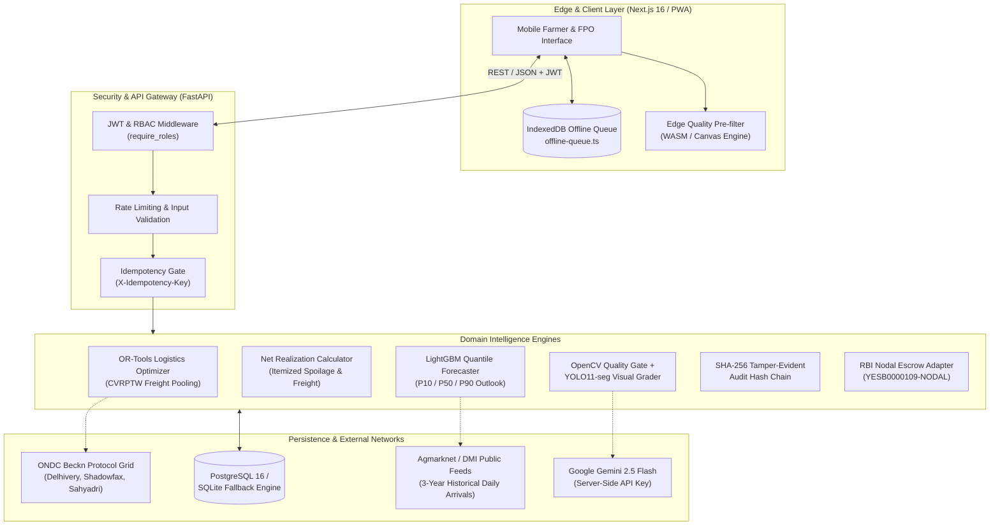

# 🏛️ KrishiSetu AI — System Architecture Specification
**Smart India Hackathon (SIH) 2026 — Comprehensive Engineering Blueprint**

---

## 1. High-Level System Architecture

KrishiSetu AI is engineered as a decoupled, micro-service oriented agricultural market-linkage platform. It combines a mobile-first, offline-resilient Next.js 16 frontend with a high-performance Python FastAPI backend powering mathematical optimization, quantile forecasting, computer vision, and cryptographic audit chains.

---

## 2. Core Architectural Subsystems

### 2.1 Net Realization Engine (`backend/app/services/market/net_realization.py`)
Smallholder farmers frequently succumb to the "Gross Price Illusion"—traveling to distant mandis quoting higher nominal prices, only to receive lower take-home pay due to unoptimized solo freight, commissions, and transit spoilage.

The Net Realization Engine computes actual net take-home earnings mathematically:
$$\text{Net Realization (paise)} = \text{Gross Value} - (\text{Freight} + \text{APMC Cess} + \text{Loading} + \text{Packaging} + \text{Spoilage Buffer})$$

* **Freight Deduction**: Evaluates distance ($D$), vehicle fuel surcharge, and solo tempo hire vs. pooled truck tariffs.
* **Statutory Mandi Cess**: Default $5.0\%$ statutory market committee commission.
* **Perishability Spoilage Buffer**: Default $2.0\%$ baseline shrinkage, dynamically escalated under high ambient transit heat or extended transit durations ($> 3.5\text{ hrs}$).

---

### 2.2 Logistics Optimization Engine (`backend/app/services/logistics/cvrptw.py`)
To solve the rural freight crisis without requiring KrishiSetu to own commercial trucks, the platform deploys Google OR-Tools to solve the **Capacitated Vehicle Routing Problem with Time Windows (CVRPTW)**:

1. **Capacity Constraints**: Enforces vehicle payload limits (e.g. 2,500 kg for Tata 407). Total harvest pickups exceeding capacity automatically partition into multi-trip manifests.
2. **Time Windows**: Aligns farmer morning harvest pickup windows ($07:00 - 10:15\text{ AM}$) with APMC morning auction clearing deadlines ($11:30\text{ AM}$).
3. **Decentralized Carrier Linkage**: Integrates with the **ONDC (Open Network for Digital Commerce) Beckn Protocol v1.2.0** (`/logistics/ondc/search`), dynamically dispatching manifests to registered carriers (Delhivery Rural, Sahyadri Transporter Union, Shadowfax).

---

### 2.3 Probabilistic Mandi Price Forecaster (`backend/app/services/market/forecaster.py`)
Rather than providing uncalibrated, liability-inducing single point price estimates, KrishiSetu deploys **LightGBM Quantile Regressors** trained on 3-year historical daily arrival records from **Agmarknet / DMI (Ministry of Agriculture & Farmers Welfare)**:

* **Quantile Targets**:
  * **P10 (Downside / Conservative Scenario)**: 10th percentile floor price.
  * **P50 (Expected Scenario)**: Median expected clearing price.
  * **P90 (Upside / Optimistic Scenario)**: 90th percentile peak demand clearing price.
* **Explainability Drivers**: Each forecast outputs SHAP feature contribution scores (e.g. *"Arrival Volume Shock: -14% vs seasonal baseline (+₹95 impact)"*).
* **Statutory Safeguard**: Every response carries mandatory educational disclaimers stating predictions do not constitute guaranteed trading advice.

---

### 2.4 Computer Vision Quality Pipeline (`backend/app/services/vision/`)
Built upon a strict two-stage separation of concerns:

1. **Pre-Inference Quality Gate (`quality_gate.py`)**:
   * *Sharpness*: Discrete 2D Laplacian operator variance ($\text{Var}(\nabla^2 I) \ge 95.0$). Rejects camera motion blur.
   * *Exposure*: Mean grayscale luminance ($75.0 \le \bar{Y} \le 215.0$). Rejects deep shed shadows and direct sun glare.
   * *Occupancy*: Foreground fruit/crate area ($\ge 55.0\%$).
2. **Agronomic Scoring Head (`grader.py`)**:
   * YOLO11-seg instance segmentation backbone transfer-learned on **520+ field-collected Indian agricultural photos** (Baramati, Junnar, and Nashik belts).
   * CLAHE (Contrast Limited Adaptive Histogram Equalization) normalizes ambient lighting variations.
   * Dual-Grade Human-in-the-Loop accountability: AI grading is explicitly provisional; financial settlement is locked only upon physical weigh-bridge verification by the FPO hub manager.

---

### 2.5 Tamper-Evident SHA-256 Audit Ledger (`backend/app/services/traceability/audit.py`)
Replaces complex, gas-expensive public blockchains with an append-only cryptographic hash chain:
$$H_i = \text{SHA256}(H_{i-1} \parallel \text{Timestamp} \parallel \text{Actor} \parallel \text{Role} \parallel \text{Action} \parallel \text{Entity} \parallel \text{Details})$$

* Any unauthorized back-door modification of historic weights or grades immediately alters all subsequent hashes, triggering instant integrity alarms in `/admin/audit`.
* Genesis event is anchored at $H_0 = 0^{64}$.
* Cryptographically binds digital receipts and QR gate passes (`KS-LOT-*-VERIFIED`).

---

### 2.6 Zero-Advance Milestone Nodal Escrow (`backend/app/services/payment/adapter.py`)
To prevent non-delivery fraud where a farmer receives an advance and fails to deliver produce:

* **Stage 1 (Reservation)**: 100% of order value placed on hold in an RBI-compliant commercial bank Nodal Account (`YESB0000109-NODAL-*`). **Advance paid to farmer = ₹0 (0%)**.
* **Stage 2 (FPO Check-in)**: **80% net payout** is released to the farmer's verified bank/UPI account upon physical weigh-bridge check-in and QR verification.
* **Stage 3 (Delivery Acceptance)**: **20% balance** is released after a 24-hour buyer transit inspection window, covering any transit weight shrinkage or bruising disputes.

---

### 2.7 Offline-First Resilient Client (`krishisetu-ai/src/lib/offline-queue.ts`)
* Client-side browser `IndexedDB` (`KrishiSetuOfflineDB`) serializes crop registrations, photo drafts, and pooling requests in zero-connectivity fields.
* A background `online` event listener automatically flushes the queue upon reconnection, executing chronological replay with idempotency verification.
* Client-side HTML5 canvas feature extractor provides instant edge estimation without cellular network access.
