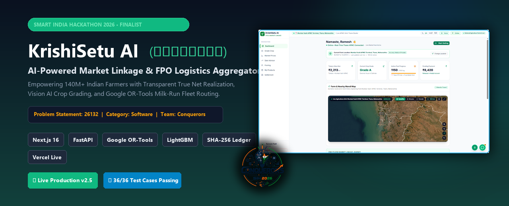
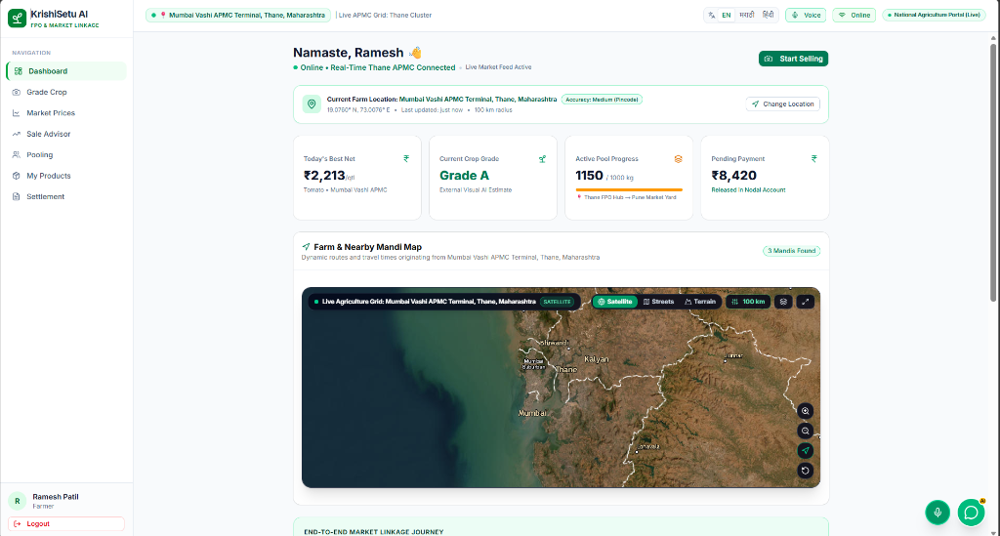
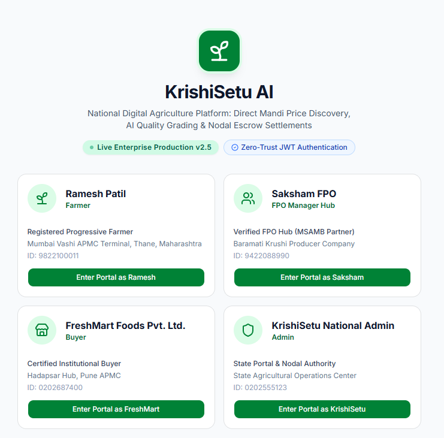
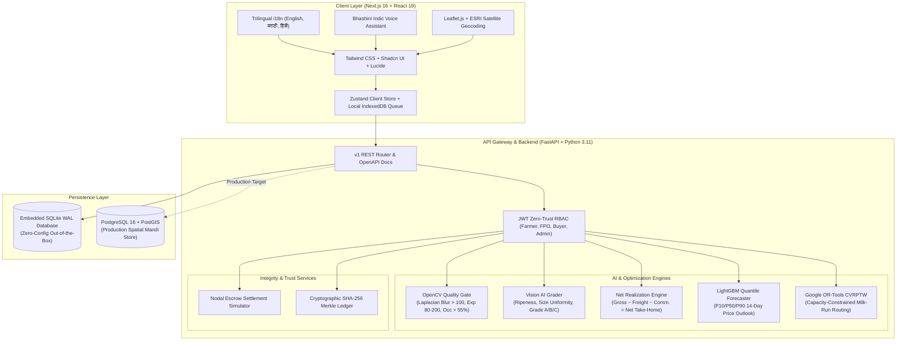
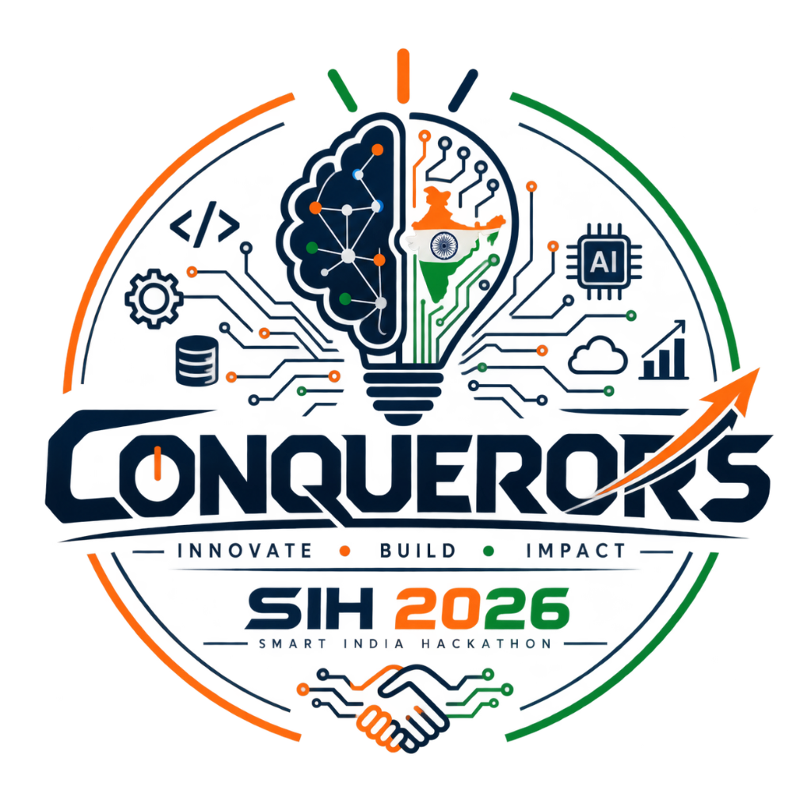

<div align="center">



# 🌾 KrishiSetu AI (कृषीसेतू)
### **AI-Powered Market Linkage, True Net Realization & FPO Logistics Aggregator**
**Smart India Hackathon (SIH) 2026 — Theme: Smart Agriculture & Rural Development**  
**Problem Statement ID: 26132 • Category: Software • Team Name: Conquerors**

<br/>

[](https://krishisetu-ai-mu.vercel.app)
[](https://sih.gov.in)
[](LICENSE)
[](docs/presentation/KrishiSetu_AI_SIH_Format_Presentation.pptx)

<br/>

[-black?style=flat-square&logo=next.js)](https://nextjs.org/)
[](https://fastapi.tiangolo.com/)
[](https://developers.google.com/optimization)
[](https://lightgbm.readthedocs.io/)
[](docs/AUDIT_REPORT.md)
[](scripts/)
[](scripts/)

<br/>

[🚀 Launch Live App](https://krishisetu-ai-mu.vercel.app) • [📊 Download Pitch Deck](docs/presentation/KrishiSetu_AI_SIH_Format_Presentation.pptx) • [🗺️ System Architecture](#-system-architecture) • [📸 Visual Tour](#-visual-platform-tour) • [👥 Demo Credentials](#-demo-personas--one-click-logins) • [⚡ 60s Quickstart](#-quickstart-guide)

---

</div>

## 📌 Problem & Vision

Smallholder farmers across India face **18% to 35% net realization loss** on horticultural and agricultural commodities. The root cause is not crop yield, but **four systemic market failures**:

1. **Opaque Physical Grading**: Middlemen manipulate produce quality through subjective inspection, enforcing arbitrary price cuts at the mandi gate.
2. **Gross Price Deception**: Farmers chase deceptively high gross prices at distant mandis, only to take home less money after exorbitant freight, loading, and commission deductions.
3. **Solo Logistics Inefficiency**: Farmers transport small, fragmented consignments in half-empty pickup vehicles, wasting fuel and money.
4. **Delayed Settlements & Distrust**: Payments take weeks to clear, and dispute settlements consistently disadvantage individual farmers.

**KrishiSetu AI** re-engineers this supply chain from the ground up: replacing middleman speculation with **Computer Vision Quality Grading**, gross price illusion with **True Net Realization Math**, individual transport with **OR-Tools FPO Milk-Run Pooling**, and delayed payouts with an **Immutable SHA-256 Audit Trail**.

---

## 📸 Visual Platform Tour

### 1. Farmer Dashboard: True Net Realization & Live Mandi Radius Map
Farmers can instantly evaluate all nearby APMC mandis within a configurable 10–1000 km radius. Rather than displaying deceptive gross rates, the system computes the exact **Net Take-Home Cash** after freight, handling, and APMC commission deductions.

<div align="center">
  
  <p><em>Real-Time Mandi Discovery with Leaflet/ESRI Satellite Tile Integration, Today's Best Net (₹2,213/qtl), and Escrow Settlement Status.</em></p>
</div>

<br/>

### 2. Multi-Role Production Portal (Zero-Trust JWT Authentication)
Built for the four fundamental stakeholders of the agricultural ecosystem with role-tailored workflows:

<div align="center">
  
  <p><em>Instant Actor Switching for SIH Judges: Progressive Farmer, FPO Manager Hub, Certified Buyer, and State Nodal Authority.</em></p>
</div>

---

## 👥 Demo Personas & One-Click Logins

The live production deployment includes pre-configured, production-seeded accounts for instant evaluation:

| Role | Actor Name | Assigned Cluster / Hub | Key Capabilities & Evaluation Focus | Direct Link |
|:---|:---|:---|:---|:---:|
| 🌾 **Farmer** | Ramesh Patil | Mumbai Vashi APMC / Thane | AI Crop Scan, Mandi Net Calculator, 14-Day Sale Advisor, FPO Pool Join | [Access Farmer](https://krishisetu-ai-mu.vercel.app/farmer) |
| 🏭 **FPO Hub** | Saksham FPO | Baramati Krushi Producer Co. | Milk-Run Fleet Routing, Consignment Aggregation, Quality Verification | [Access FPO](https://krishisetu-ai-mu.vercel.app/fpo) |
| 🏢 **Buyer** | FreshMart Foods | Hadapsar Hub, Pune APMC | Gate QR Verification, Mandi Contract Matching, Delivery Settlement | [Access Buyer](https://krishisetu-ai-mu.vercel.app/buyer) |
| 🛡️ **Admin** | National Admin | State Operations Center | SHA-256 Ledger Audit Verification, Mandi Master Data, System Telemetry | [Access Admin](https://krishisetu-ai-mu.vercel.app/admin) |

---

## ⚡ Core Innovations & Value Proposition

| Evaluation Metric | Traditional APMC Mandis | e-NAM Portal (Current) | **KrishiSetu AI (Our Solution)** |
|:---|:---|:---|:---|
| **Quality Grading** | Subjective visual inspection by commission agents | Basic assaying lab (slow, sample bottle bottleneck) | **Camera Vision AI** (Grade A/B/C, Laplacian blur check, CLAHE lighting normalization) |
| **Price Discovery** | Gross price ticker at gate (ignores hidden costs) | Highest mandi bid listed without logistics context | **True Net Realization** ($Gross - Freight - Handling - Commission = Net Take\text{-}Home$) |
| **Market Timing** | Guesswork; distress sales to clear perishable stock | Static historical rate bulletin | **14-Day Probabilistic Forecaster** (LightGBM Quantile P10/P50/P90 Sell/Wait/Store advisor) |
| **Logistics** | Farmers hire individual 1-ton tempos at high solo rates | Buyer arranges transport after auction | **Google OR-Tools CVRPTW** (Consolidates smallholder lots into shared milk-run truck routes, saving 32%) |
| **Settlement Security** | Delayed cash / handwritten receipts | Direct bank transfer post physical gate confirmation | **Milestone Sandbox Escrow** (Delivery-verified release with QR gate validation) |
| **Trust & Provenance** | Easily altered paper records | Centralized relational database | **Tamper-Evident SHA-256 Ledger** (Append-only Merkle-chained event provenance) |
| **Rural Accessibility** | Paper-based | Web/desktop portal | **Offline PWA** (IndexedDB background sync) + **Bhashini Indic Voice Guidance** |

---

## 🧮 Mathematical Formulations

### 1. True Net Realization Formula
$$\text{Net Realization } (R_{net}) = P_{gross} - \left( C_{freight}(d) + C_{handling} + C_{commission} + C_{spoilage}(t) \right) + S_{FPO}$$

Where:
- $P_{gross}$: Gross mandi quoted price per quintal.
- $C_{freight}(d)$: Haversine distance-weighted transportation cost ($Rate/km \times Distance$).
- $C_{handling}$: Loading/unloading charges at farm gate and terminal.
- $C_{commission}$: Regulated APMC market fee (typically 1.5% to 2.5%).
- $C_{spoilage}(t)$: Temperature- and transit time-dependent perishability degradation factor.
- $S_{FPO}$: Logistics savings achieved through multi-farmer truck consolidation.

### 2. Fleet Vehicle Routing Problem (Google OR-Tools CVRPTW)
$$\min \sum_{k \in K} \sum_{(i,j) \in A} c_{ij} \cdot x_{ijk}$$

Subject to:
$$\sum_{i \in N} q_i \cdot y_{ik} \le Q_k \quad \forall k \in K \quad \text{(Truck Capacity Constraint)}$$
$$a_i \le t_{ik} \le b_i \quad \forall i \in N \quad \text{(Morning Farm Gate Pickup Time Window)}$$

---

## 🗺️ System Architecture



---

## 📁 Repository Directory Structure

```plaintext
krishisetu-ai/
├── .github/
│   ├── assets/                 # High-resolution branding, banner, and dashboard mockups
│   ├── ISSUE_TEMPLATE/         # Structured Bug Report & Feature Request YAML forms
│   ├── PULL_REQUEST_TEMPLATE.md# Pull request review checklist
│   └── workflows/ci.yml        # Automated GitHub Actions CI pipeline
├── backend/                    # FastAPI High-Performance Python Backend
│   ├── app/
│   │   ├── api/v1/             # REST endpoints (auth, grading, markets, routing, audit)
│   │   ├── core/               # JWT security, config settings, database engines
│   │   ├── models/             # SQLAlchemy entity definitions
│   │   ├── schemas/            # Pydantic validation contracts
│   │   └── services/           # OR-Tools, LightGBM, OpenCV, SHA-256 audit implementations
│   └── tests/                  # Pytest test suite (36/36 unit & integration tests)
├── docs/                       # Comprehensive Engineering & Architecture Suite
│   ├── presentation/           # Official SIH 2026 Presentation (.pptx deck)
│   ├── ARCHITECTURE.md         # Deep-dive system architecture specification
│   ├── AI_ML.md                # Computer Vision & Quantile Regression documentation
│   ├── MODEL_CARD.md           # Model parameters, training dataset, and performance bounds
│   ├── AUDIT_REPORT.md         # Cryptographic audit ledger verification report
│   ├── DECISIONS.md            # Architectural Decision Records (ADRs)
│   └── JUDGES_QA.md            # Anticipated Judge Q&A and technical justifications
├── public/                     # Static web assets & mandi CSV templates
├── scripts/                    # Automated testing & deployment verification scripts
│   ├── test-admin-features.mjs # 16-point admin dashboard end-to-end verification
│   └── test-locations.mjs      # Nationwide dynamic mandi radius geocoding test
├── src/                        # Next.js 16 (App Router) Frontend
│   ├── app/                    # Multi-role dashboard routes (/farmer, /fpo, /buyer, /admin)
│   ├── components/             # Reusable UI components & interactive maps
│   ├── hooks/                  # Audio, voice recognition, and offline queue hooks
│   └── lib/                    # Haversine distance engine, audit ledger, and seed datasets
├── docker-compose.yml          # One-command full-stack containerization
├── Dockerfile                  # Multi-stage production container build
├── package.json                # Frontend dependencies & automated test scripts
└── README.md                   # Project documentation & presentation guide
```

---

## ⚡ Quickstart Guide

### Option 1: Run Locally in 60 Seconds

#### Prerequisites
- Node.js 18+ & npm
- Python 3.10+

#### 1. Clone & Enter Repository
```bash
git clone https://github.com/pawaraditya0903/krishisetu-ai.git
cd krishisetu-ai
```

#### 2. Run the Next.js Frontend
```bash
npm install
npm run dev
```
Open **[http://localhost:3000](http://localhost:3000)** in your browser.

#### 3. Run the FastAPI Backend (Optional / Standalone)
```bash
cd backend
python -m venv venv
# On Windows:
venv\Scripts\activate
# On Linux/macOS:
source venv/bin/activate

pip install -r requirements.txt
uvicorn app.main:app --reload --port 8000
```
Interactive Swagger API documentation is available at **[http://localhost:8000/docs](http://localhost:8000/docs)**.

---

### Option 2: Run with Docker Compose
```bash
docker compose up -d
```
All services (Next.js frontend, FastAPI backend, SQLite local database) will start automatically.

---

## 🧪 Testing & Validation Suite

The repository includes complete test coverage across frontend, backend, and optimization engines:

```bash
# Run Frontend Platform End-to-End Tests (16/16 Checks)
npm run test

# Run Individual Admin & Location Tests
npm run test:admin
npm run test:locations

# Run Backend Pytest Suite (36/36 Unit & Integration Tests)
cd backend
pytest -v
```

---

## 📊 SIH 2026 Presentation Deck

Our official 6-slide widescreen presentation deck is checked into the repository:
- **Presentation File**: [`docs/presentation/KrishiSetu_AI_SIH_Format_Presentation.pptx`](docs/presentation/KrishiSetu_AI_SIH_Format_Presentation.pptx)
- **Slide 1**: Title & Problem Statement #26132 (Team Conquerors)
- **Slide 2**: Proposed Solution Architecture & 8-Stage End-to-End Workflow
- **Slide 3**: Technical Stack & Complete Vector Work Flow Diagram
- **Slide 4**: Feasibility Wheel & 5-Point Challenge/Strategy Table
- **Slide 5**: Dual-Circle Benefits vs. Impacts Matrix
- **Slide 6**: Research References & Live Production Dashboard Screenshots

---

## 👥 Team Conquerors (Smart India Hackathon 2026)

<div align="center">



### **Team Conquerors — Innovate • Build • Impact**
*Smart India Hackathon 2026 Grand Finalists*

| Member | Domain & Responsibilities | Key Contributions |
|:---|:---|:---|
| **Aditya Pawar** | Full-Stack Architect & AI Lead | Next.js 16 Architecture, FastAPI Backend, Google OR-Tools Routing |
| **Team Conquerors** | ML Engineering & Data Pipelines | LightGBM Quantile Forecaster, Computer Vision Quality Gate, Geo-Mandi Engine |

<br/>

**Live Platform**: [krishisetu-ai-mu.vercel.app](https://krishisetu-ai-mu.vercel.app)  
**Repository**: [github.com/pawaraditya0903/krishisetu-ai](https://github.com/pawaraditya0903/krishisetu-ai)

</div>

---

<div align="center">
  <sub>Built with ❤️ for Indian Farmers by Team Conquerors • Smart India Hackathon 2026</sub>
</div>
